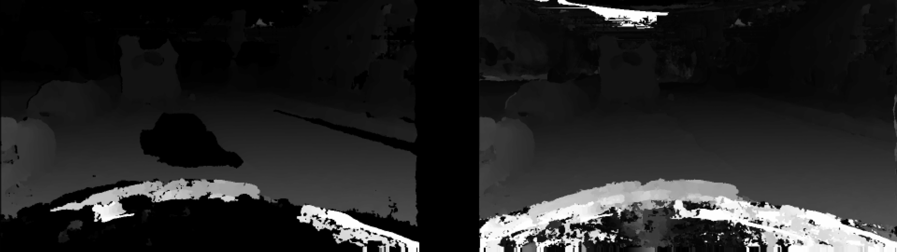
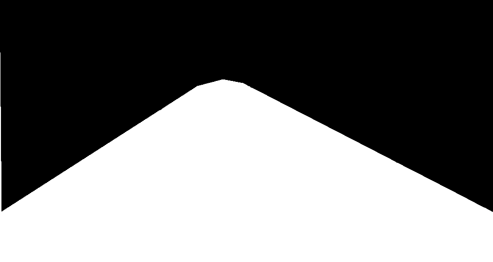
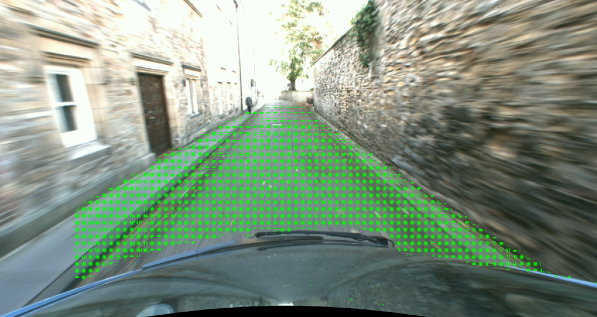
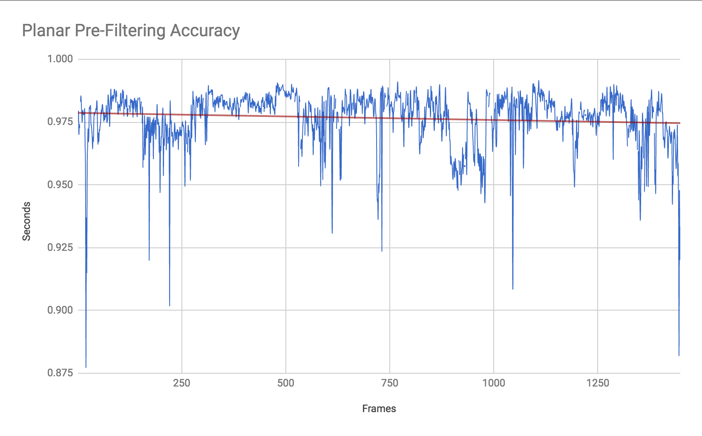
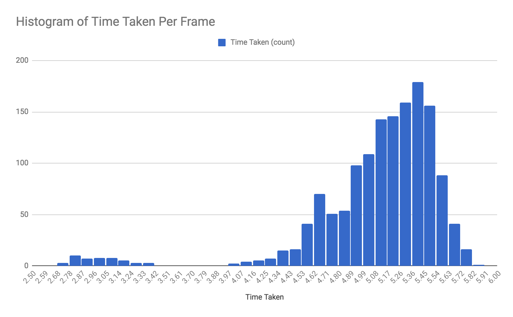

# Stereo Vision

The task was to find the plane on the images, and find the visible road. Bonus points for detecting objects on the road, and for drawing the normal of the plane. A video of the full lap can be found at [https://www.youtube.com/watch?v=cNyDkLB4jSc](https://www.youtube.com/watch?v=cNyDkLB4jSc).

## Run:

Assuming you have access to the data, this program can be run with:

    python3 loop.py

## 1. Pre Filtering
When both images are loaded, they are faced with gamma corrections followed by a greyscale conversion. Afterwards, the greyscale images are  faced with histogram equalisation to counter any defects on colours ranges.

## 2. Disparity Processing

The left and right greyscale image channels are then used to create the disparity. In the event that there is information missing, black points in the disparity image (produced as a result of noise from the input channels) are filled using the values from the previous disparity through overlaying. This improves in quality over time as more information is stored, and works especially well when the car is not travelling fast. 

## 3. Disparity Post-Processing
A heuristic is used where the majority of the road tends to fit within a certain area within the image. A mask that fits the road is used as our guide, and make a masked disparity image from it.

## 4. Disparity to Point Clouds
We convert the disparities (both the original disparity, and the masked disparity) to point clouds. To improve the performance, we increment the step counter by 2 (such that it skips a point per iteration). For the original disparity, we also store rgb values of image_L.

This reduces the number of operations whilst retaining sufficient points needed to compute an accurate plane. Other step counters have been considered but during experiments it is found to lose too much information.

The ZMax cap is no longer used (from the original code), but we use the disparity value of a given point to calculate the Z Position:

`Z = f*B/disparity(y,x).`

## 5. Plane Finding with RANSAC

RANSAC is used to compute a plane using 3 random points from the point cloud of the original disparity. We iterate this 600 times, storing the best plane throughout the iterations. We measure the performance of the plane by calculating the mean error from our random sample of points from a random sample (400 points) of the masked disparity point cloud. The lower the mean error, the better the plane fitting.

Computing the plane using the disparity image has been trialed (to bypass computing a 3d point cloud), but this has shown to be less precise due to the disparity range. Increasing the `max_disparity` variable does not improve this. 

## 6. Generating Road Points

For each point in the original disparity we calculate its distance from the plane using the plane coefficients. We threshold points if they are far enough.

A histogram is then calculated for the remaining points, using the HSV Hue value of each point. With this histogram, we remove points that are not within the most populous colours using a colour threshold.

The remaining points from the cloud are projected back to 2D image points.

## 7. Cleaning Road Points

From the road image, we perform a series of image manipulation operations:
- Morphological closing to fill small holes within the road image
- Eroding with a 9x9 kernel
- Capping the road image view by masking it upon a road threshold mask
- Performing another morphological closing
- Removing noisy/small pixels again through contour detection

## 8. Obstacle Detection

With Obstacle detection, we look at the points within the convex hull of the remaining road image. Points that are not recognised as the road but are within the confines of the hull are treated as obstacles on the road.

This is performed by:
- creating a convex hull of the road image
- creating a mask using the convex hull
- inverting the original road image to show the obstacle spots and overlaying the mask created prior
- colouring the corresponding points yellow
- overlaying the obstacle points onto the resulting image

## 9. Drawing Road and Normal Shapes

This is done by drawing the convex hull on the image. Then, the centre point is calculated from the points generated from the hull. A normal vector line is generated by converting the centre point into a 3D coordinate, and using the normal vector, we calculate a new point by adjusting the Y point, keeping the X point and using the vector equation to calculate the new Z point. The new 3d point is then converted back to a 2D point and the pair of points is sent back to be drawn on the image.

## Performance

